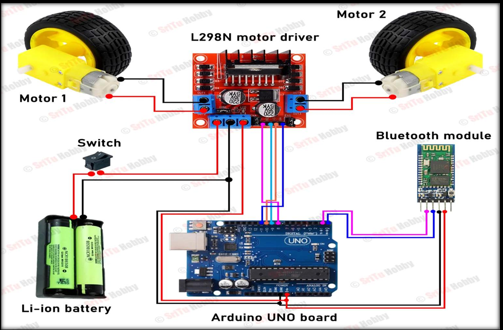

# DC Motor Control using Bluetooth (Arduino Project)

This project controls two DC motors using a mobile phone through a Bluetooth module (HC-05). 
Commands like Forward, Backward, Left, Right, and Stop are sent wirelessly from a smartphone 
to the Arduino.

### 📌 Components Used
- Arduino Uno
- Bluetooth Module HC-05
- Motor Driver L298N
- Two DC Motors
- 9V Battery / Li-ion Battery
- Push Buttons (Manual Control)
- Connecting Wires

### ✅ How It Works
1. Phone sends command via Bluetooth
2. Arduino receives command
3. Motor driver moves motors accordingly

| Command | Action |
|---------|--------|
| F | Move Forward |
| B | Move Backward |
| L | Turn Left |
| R | Turn Right |
| S | Stop |

---

### ✅ Arduino Code
Code is inside the file: `DC_Motor_Control.ino`

---

### 📷 Circuit Diagram

---

### ✅ Results
✓ Bluetooth communication successful  
✓ Motors respond in real-time  
✓ Manual push button works as backup  

---

### 👨‍💻 Made By
**Tahir Ali  and Mohsin raza— Namal University Student**
